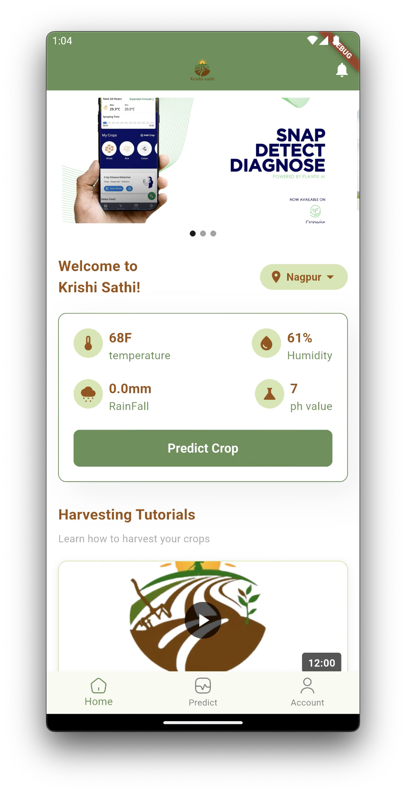
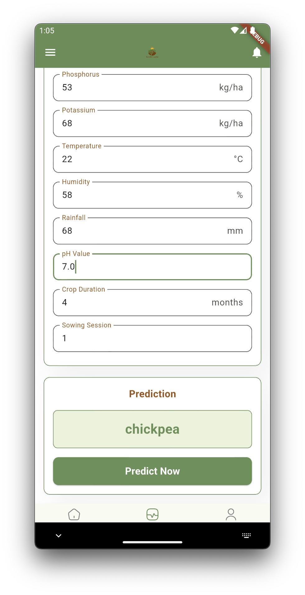
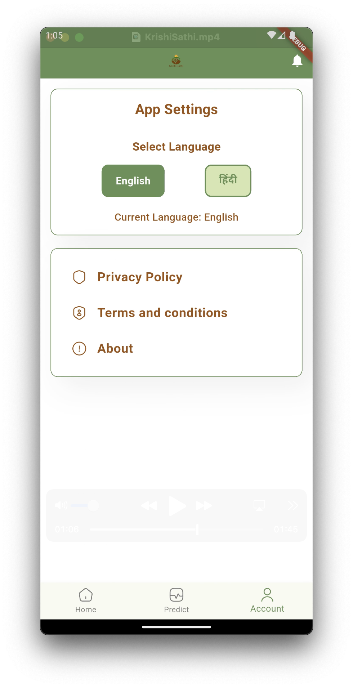
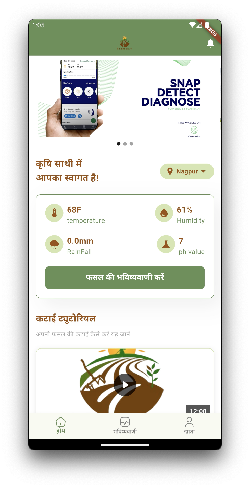
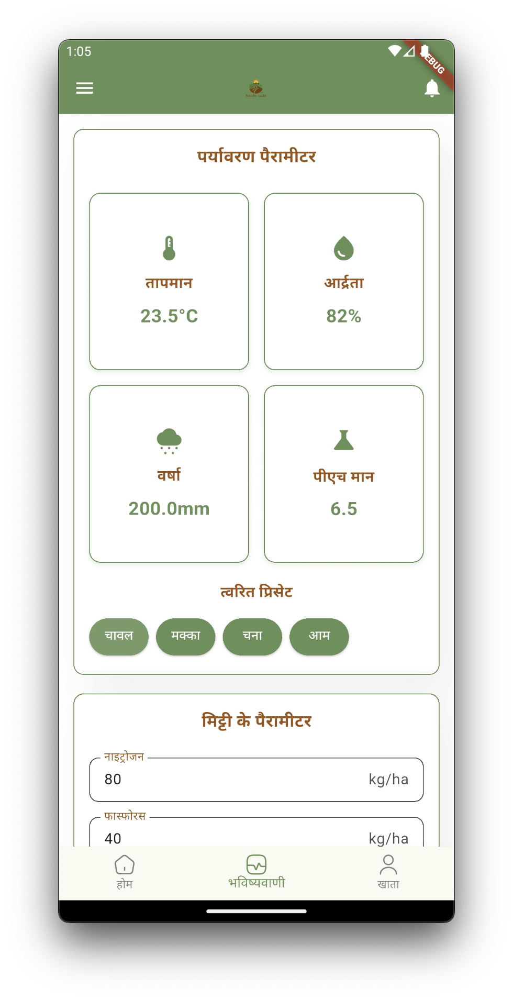

# Krishi Sathi

Krishi Sathi is a ground-breaking mobile application created to empower farmers by offering precise forecasts for seasonal crops and individualized crop suggestions. This software uses cutting-edge data analytics, machine learning algorithms, and agricultural knowledge to help farmers make educated decisions about crop selection practices, with the goal of maximizing agricultural output and sustainability.

This repository contains the source code for the app. The app is designed to help farmers predict the most suitable crop based on certain input values and provide recommendations for fertilizers. It aims to assist farmers in making informed decisions about crop selection and optimizing agricultural practices.

## Features

- ML Powered Crop prediction based on Soil testing values
- Recommended crop suggestions
- User-friendly interface for easy input and navigation

## Technologies Used

- Flutter: A cross-platform framework for building mobile applications.
- Dart: The programming language used with Flutter.
- Machine Learning and its Algorithms such as Decision tree and libraries like Tensorflow
# KrishiSathi

